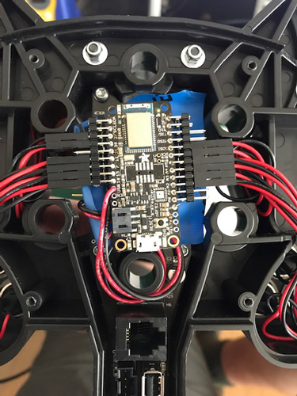

# Bluetooth Button Box

A Bluetooth low energy wireless button box circuit for use with sim racing. It is based on the the Adafruit Feather nRF52 Bluefruit development board. It can be embedded into existing wheels and appears as a standalone gamepad on most desktop computers.

## Usage

This project targets a very small bluetooth development board made by Adafruit Industries. The latest board is a the Adafruit Feather nRF52840 Express (4062) and can be purchased for around $30 USD.

This device is arduino compatible and uses a very simple sketch to give battery operated gamepad functionality with fairly little effort.

You'll need:

* An Adafruit Feather nRF52840 Express
* A lithium polymer battery pack (250-2000mAh)
* Soldering supplies
* Normally open switches of any kind
* A bluetooth USB dongle or onboard Bluetooth 5+ support

The firmware is located in the firmware/NRF52840 directory. Use the readme to download and install the firmware.

## Pairing and Usage

Once the sketch is flashed to the board, the board will begin to advertise and will wait indefinitely to pair with a PC. While in pairing mode, the LED will strobe and once paired, it will turn off to conserve batteries. You can then verify the buttons are working by going to gamepad settings in Devices & Printers on Windows.

You should now be able to use the controller like any other joystick/gamepad in your games. If it doesn't show up in a particular game, skip to the advanced mapping section below to setup a virtual controller.

## Embedding the Board

The board can simply be hooked up to USB inside your button box and all the individual switches soldered directly to the board.

If you want to retrofit it into an existing non-wireless button box, the easiest method would be pulling the +5V and GND from USB off the existing button box and wiring +5V to the USB header and GND to the GND terminal on the Feather board. This will allow you to wire periodically to charge.

## Advanced Usage

Since this software is arduino compatible, you can configure the board to use rotary encoders, pulse switches, funkyswitches and 4/8 way joysticks with a bit of coding. The board itself is very versatile, fast and has  plenty of RAM, so I2C and SPI input devices will also work.

## Advanced Mapping

If you would like more mapping options, you can use vjoy and UJR to create a larger button set out of the rest of your sim controls. This will allow you to map the buttons on the wheel and dash into a unified joystick. More details here: [Using UJR to Map Buttons](https://www.reddit.com/r/flightsim/comments/6dp4mh/how_to_use_racing_pedals_as_rudder_pedals_for/)

## Legacy Boards

The NRF52832 boards are now obsolete, but this library still supports them. You can find the firmware in the firmware/NRF52832 directory. Use the readme to guide you through the installation.
